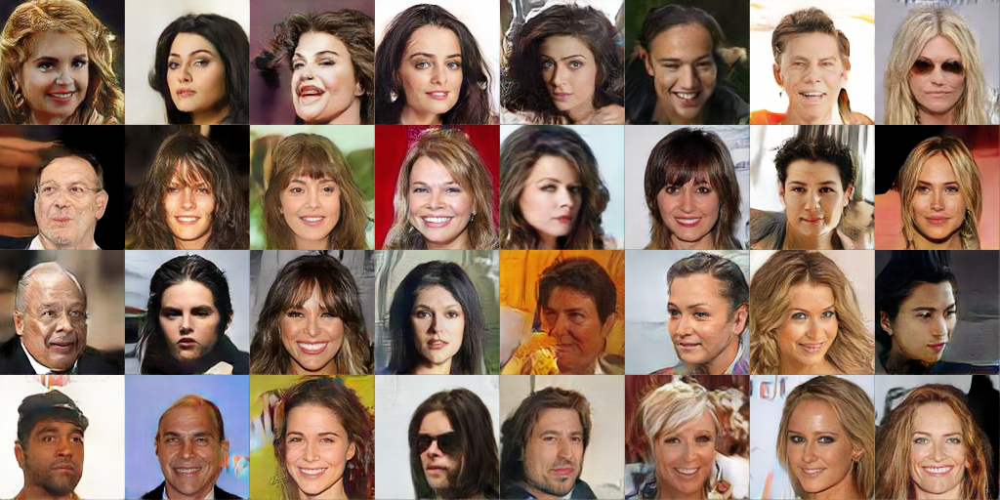

# OCFGAN-GP

This repository contains code for the CVPR 2020 paper *[A Characteristic Function Approach to Deep Implicit Generative Modeling](https://arxiv.org/abs/1909.07425)*. In this paper, we proposed a method of training a Generative Adversarial Network (GAN) by minimizing the expected distance between empirical characteristic functions of the real and generated data distributions. The generator seeks to minimize what we term as the Empirical Characteristic Function Distance (ECFD), whereas the discriminator maximizes it. Given samples from a distribution, the empirical characteristic function is given by
<p align="center">
  
</p>
and the ECFD between two distributions is given by
<p align="center">
  
</p>

<p align="center">
  
  <br/>
  <span>Fig. 1: Samples generated by OCFGAN-GP trained on CelebA 128 x 128 dataset.</span>
</p>

## Dependencies

* Pytorch (tested on v1.2.0) & torchvision (tested on v0.4.0)
* Numpy (tested on v1.17.2)
* OpenCV (tested on v4.1.1)
* Scipy
* Pillow
* tqdm
* scikit-learn
* CUDA 10

## Usage

### Generating samples from pre-trained models

* Download the pre-trained generators from releases.
* Run the following command to generate an 8x8 grid of samples from a model trained on CIFAR10 dataset:
```bash
python src/gen_samples.py\
 --png\
 --imsize 32\
 --noise_dim 32\
 --gen flexible-dcgan\
 --out_dir ./ checkpoint.pth
```
* Refer to the shell scripts for `--imsize`, `--noise_dim`, and `--gen` parameters for other datasets.

### Training your own model

* **Downloading Datasets**: All the datasets will download by themselves when the code is run, except CelebA. CelebA can be downloaded by executing `python download.py celebA`. Rename the directory `./data/img_align_celeba` to `./data/celebA` after the script finishes execution.
* Run `python src/main.py --help` to see a description of all the available command-line arguments.
* **Example**: run the following command to train on the CIFAR10 dataset:
```bash
python src/main.py\
 --dataset cifar10\
 --dataroot ./data/cifar10\
 --model cfgangp\
 --batch_size 64\
 --image_size 32\
 --nc 3\
 --noise_dim 32\
 --dout_dim 32\
 --max_giter 125000\
 --resultsroot ./out
 --gpu_device 0\
 --num_freqs 8\
 --weight gaussian_ecfd\
 --sigmas 0.
```
* Alternatively, use the provided shell scripts to train the models. For example, run `bash stl10.sh` to train OCFGAN-GP on the STL10 dataset.

The generated images will be written in `./out/<dataset>/<model>/<gen-network>/samples/` and the model checkpoints will be saved in `./out/<dataset>/<model>/<gen-network>/checkpoints/`.

### Questions?
For any questions regarding the code or the paper, please email me at [abdulfatir@u.nus.edu](mailto:abdulfatir@u.nus.edu).

### BibTeX

```
@inproceedings{ansari2020characteristic,
  title={A Characteristic Function Approach to Deep Implicit Generative Modeling},
  author={Ansari, Abdul Fatir and Scarlett, Jonathan and Soh, Harold},
  booktitle={IEEE Conference on Computer Vision and Pattern Recognition},
  year={2020}
}
```

#### Acknowledgements
Parts of the code/network structures in this repository have been adapted from the following repos:

* [ozanciga/gans-with-pytorch](https://github.com/ozanciga/gans-with-pytorch)
* [OctoberChang/MMD-GAN](https://github.com/OctoberChang/MMD-GAN)
* [mbinkowski/MMD-GAN](https://github.com/mbinkowski/MMD-GAN)